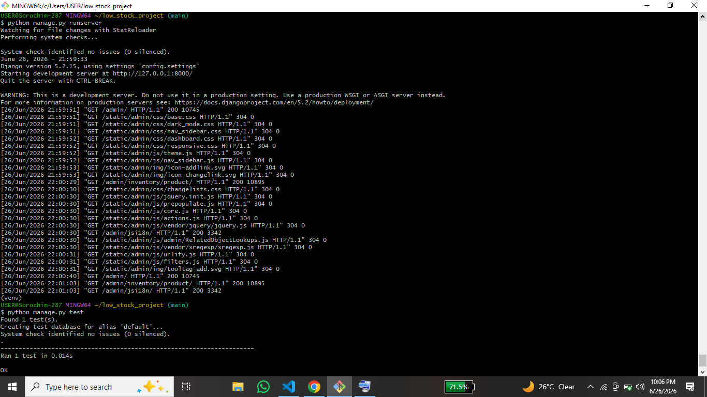

# Django Low Stock Dashboard

A Django web application that helps administrators identify products running low on stock and provides reorder suggestions based on a configurable threshold.

## Features

* Inventory Dashboard
* Configurable Low Stock Threshold
* Reorder Suggestions
* Django Admin Interface
* Automated Tests

## Tech Stack

* Python
* Django
* SQLite
* HTML
* Git & GitHub

## Project Structure

```
django-low-stock-dashboard/
│── config/
│── inventory/
│── screenshots/
│── manage.py
│── README.md
```

## Installation

```bash
git clone https://github.com/wilcox287/django-low-stock-dashboard.git
cd django-low-stock-dashboard

python -m venv venv

# Windows
venv\Scripts\activate

pip install django

python manage.py migrate

python manage.py runserver
```

Visit:

```
http://127.0.0.1:8000
```

## Screenshots

### Inventory Dashboard


### Django Admin


### Successful Test Output



### Git Push


### GitHub Repository


## Future Improvements

* Search products
* Product categories
* Email alerts for low stock
* REST API
* Docker support

## Author

**Wilcox**
